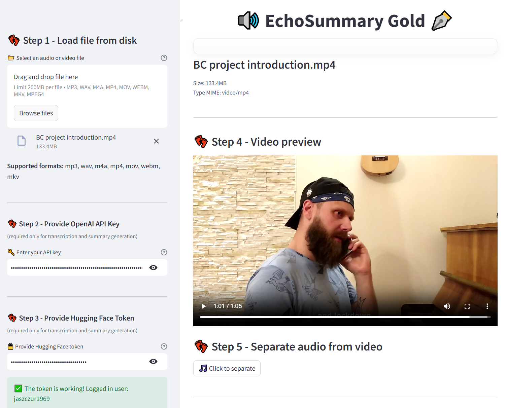
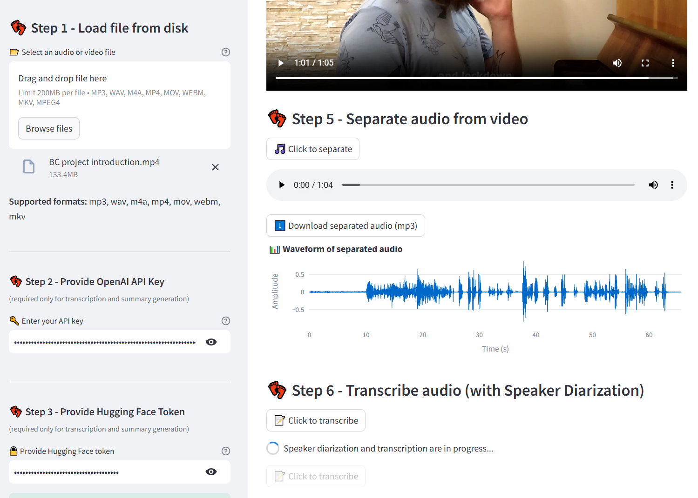
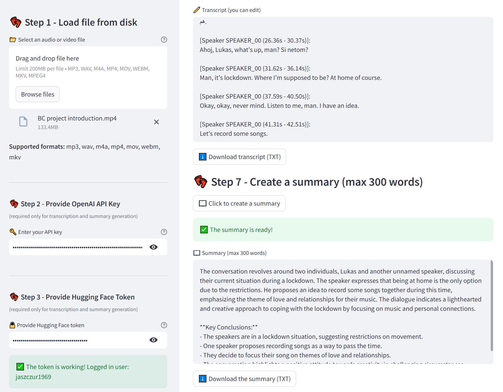

# **EchoSummary Gold** - Transform hours of audio into minutes of insight

**Overview**

EchoSummary Gold is your smart assistant for transforming audio and video recordings into clear, actionable knowledge. Whether it’s a business meeting, academic lecture, or creative interview, EchoSummary Gold turns hours of content into precise transcripts and insightful summaries — instantly. Supporting a wide array of formats including MP3, WAV, M4A, MP4, MOV, WEBM, and MKV, it blends cutting-edge AI with a sleek, intuitive interface to make complex processes effortless.

**Key features**

- Universal Format Support – Seamlessly process multiple audio and video file types.
- High-Precision Transcription – Turn recordings into clean, accurate text in minutes.
- AI-Powered Summaries – Get concise, meaningful overviews without the extra work.
- Speaker Diarization – Instantly identify who spoke and when.
- Interactive Waveform Visualization – Explore audio content visually for smarter navigation.
- Edit & Export – Refine transcripts and export them as TXT files for effortless sharing and storage.

**Built With**

- OpenAI GPT-4o-mini – state-of-the-art and low-cost transcription and summarization engine
- Pyannote Audio (Hugging Face) – advanced speaker diarization
- Plotly – beautiful and interactive waveform visualizations
- pydub – powerful audio extraction and format conversion
- NumPy – robust data processing
- Streamlit – a smooth and interactive web interface

[GitHub repository](https://github.com/Jaszczur1969/EchoSummary_Gold.git){ .button-link target="_blank" }

