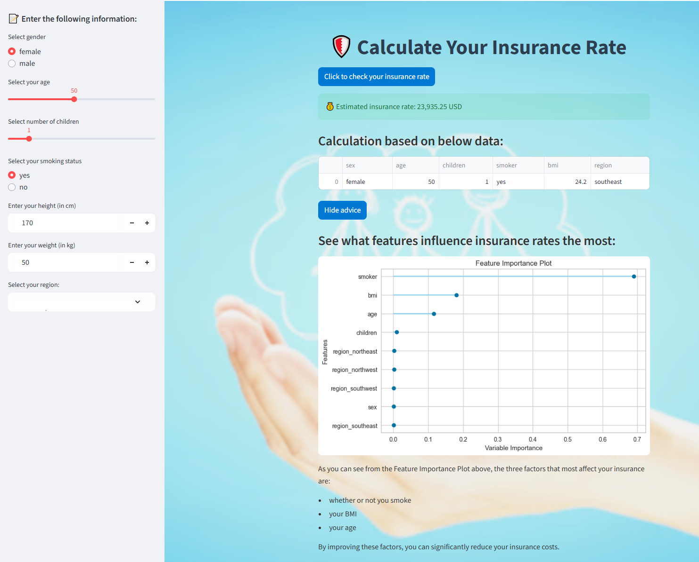
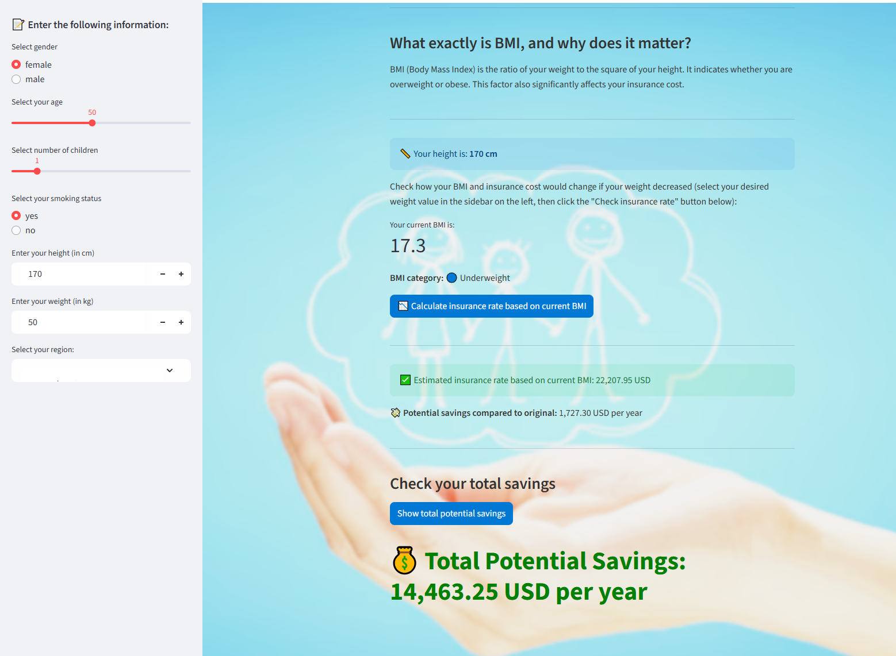

# **Insurance predictor** - praktyczny kalkulator do wyliczenia wysokości ubezpieczenia

**2025-08-02**

Zapraszam do zapoznania się z moją praktyczną aplikacją do wyliczenia wysokości ubezpieczenia na podstawie danych wejściowych od użytkownika:

- Płci
- Wieku
- Ilości posiadanych dzieci
- Czy użytkownik jest palaczem
- Wzrostu
- Wagi
- Rejonu pochodzenia (obszary USA)

Użytkownik po otrzymaniu szacunkowego wyliczenia wysokości ubezpieczenia otrzymuje też szereg  informacji na temat, które z podanych parametrów najbardziej wpływają na wysokości ubezpieczenia oraz czym jest wskaźnik BMI. Może następnie ponownie wyliczyć wysokość ubezpieczenia w przypadku gdyby zmienił parametry (np. rzucił palenie, schudł itd.) i porównać jakie poczyni wtedy oszczędności.

Dane do wytrenowania modelu pochodzą z Pycaret Datasets