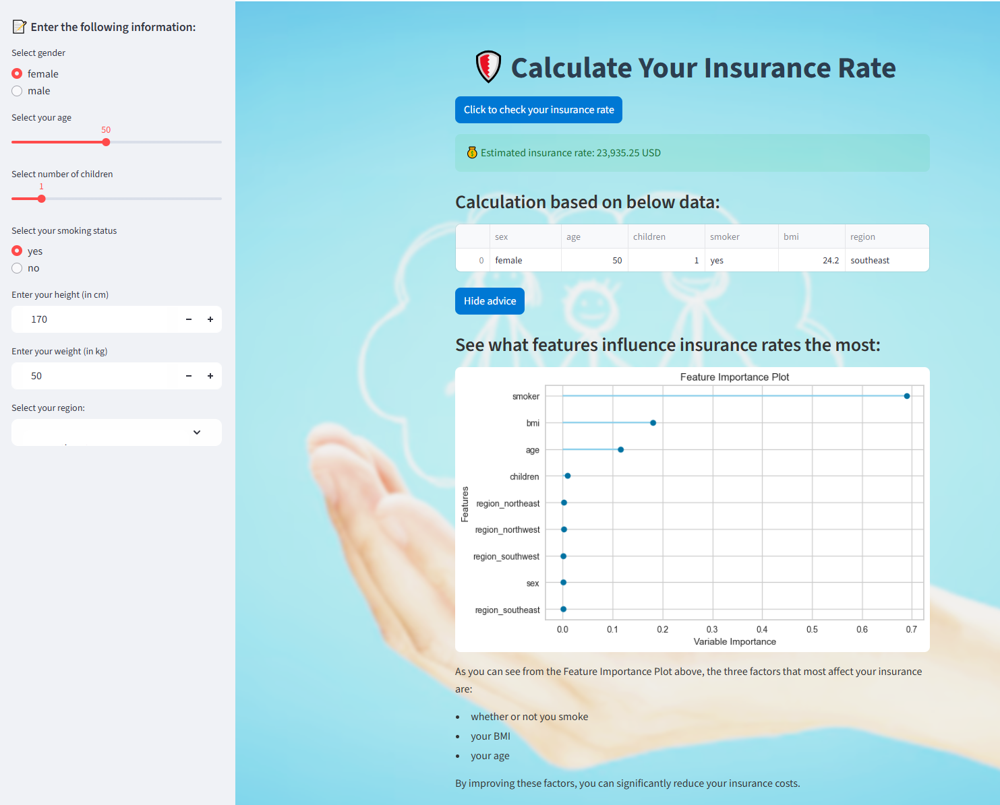
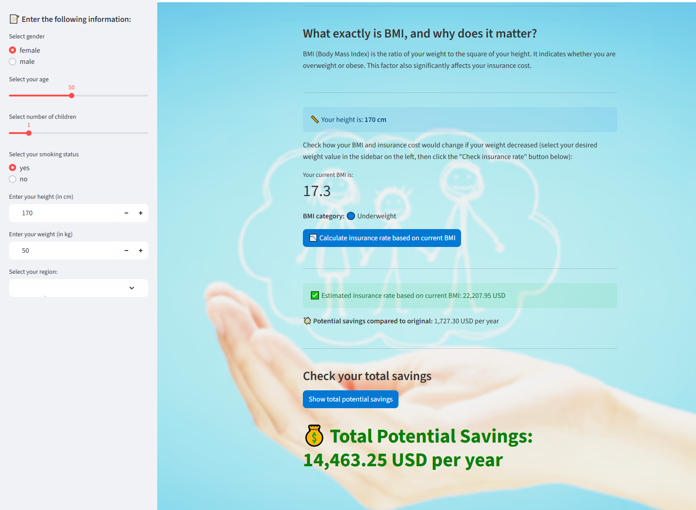

# **Insurance predictor** - praktyczny kalkulator do wyliczenia wysokości ubezpieczenia

**2025-08-02**

Discover my practical app designed to estimate your insurance premium based on the details you provide:

- Gender
- Age
- Number of children
- Smoking status
- Height
- Weight
- Region of residence (across the U.S.)

Once you receive your personalized insurance estimate, the app also highlights which factors have the biggest impact on your premium and explains the role of the Body Mass Index (BMI).

You can then adjust your inputs — such as quitting smoking or losing weight — and instantly recalculate your premium to see how much you could save. This way, the app not only gives you an estimate but also motivates you to make positive lifestyle changes that reduce costs in the long run.

Built on the powerful Streamlit engine and enhanced with regression modeling powered by PyCaret, my app combines modern technology with simplicity and speed.

[Link do aplikacji na Streamlit](https://insurance-predictor-jaszczur1969.streamlit.app){:target="_blank"}

[Link do repozytorium na GitHub](https://github.com/Jaszczur1969/Insurance_prediction.git){:target="_blank"}

