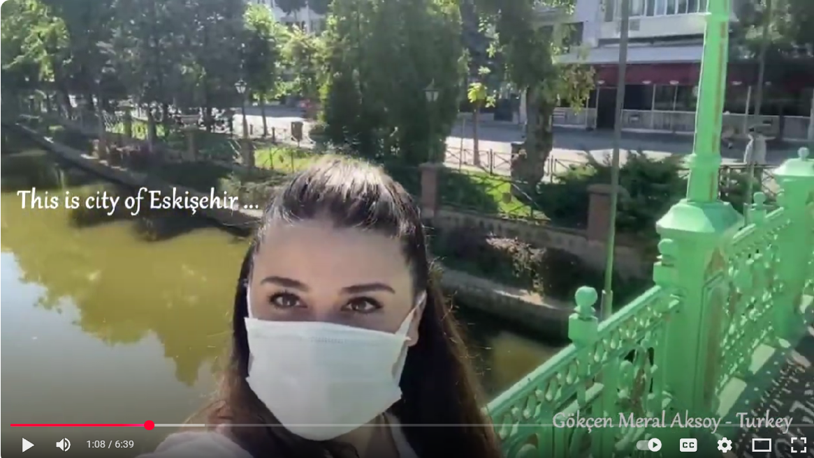
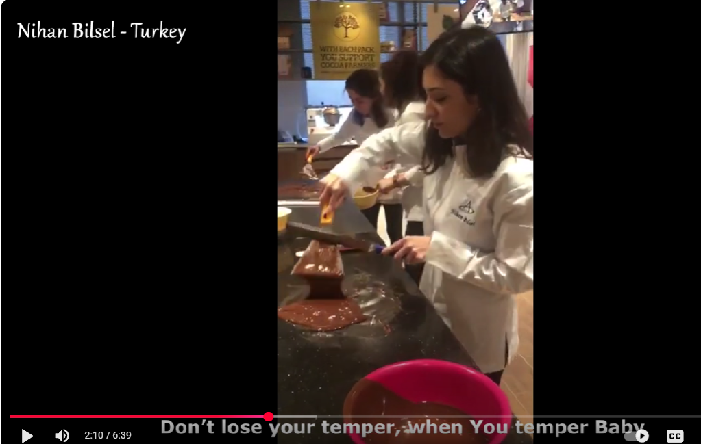
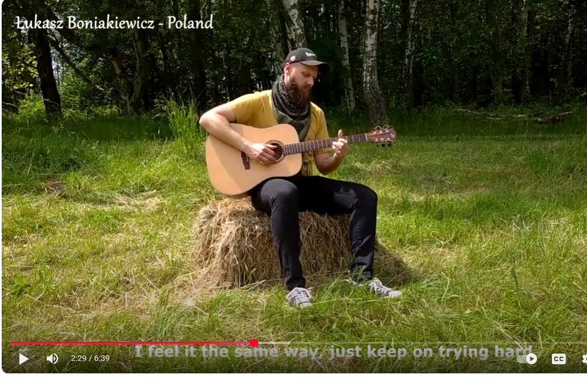
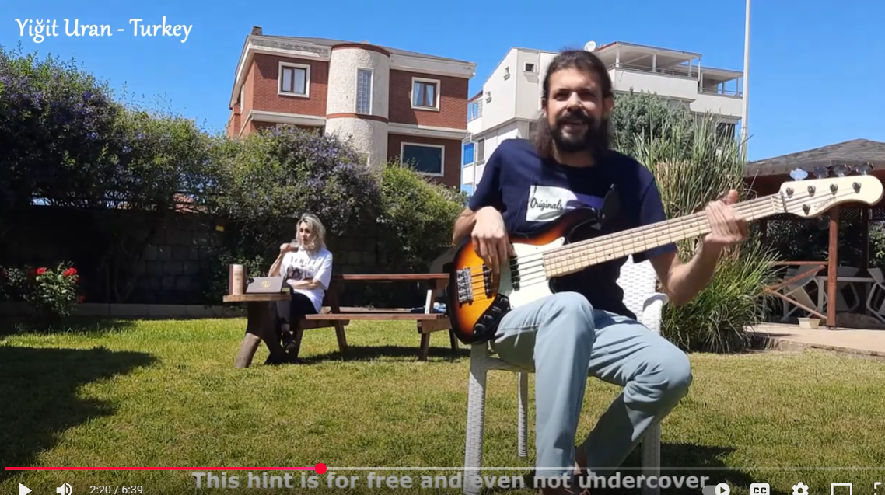

# Musicolate project

In 2021, I led a collaborative music project with colleagues from Barry Callebaut Group across the World. The result is an original song and music video that capture the experience of working through lockdown — all centered around Barry Callebaut’s flagship product: chocolate. Enjoy watching!

[YouTube link](https://www.youtube.com/watch?v=0mS8_Ai_9-Q&t=215s){ .button-link target="_blank" }

