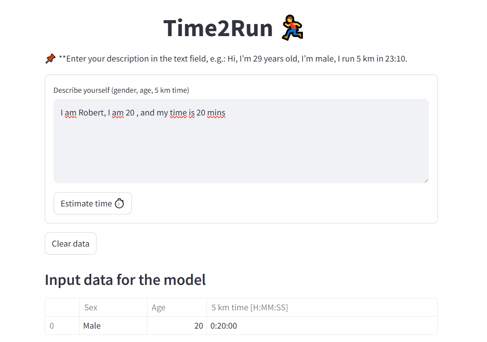
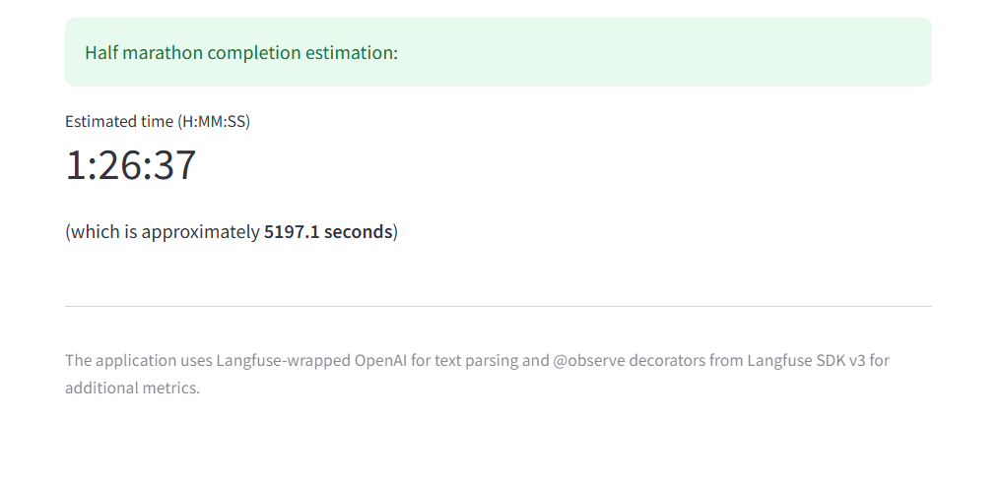

# **Time2Run** - Your Personal Half Marathon Calculator

**Overview**

Ever wondered how fast you could finish a half marathon based on your pace and age? Time2Run is an interactive app that delivers a personalized prediction for the 21.097 km distance in just seconds. Simply enter a short description about yourself – for example, “I’m 29, male, and run 5 km in 23:10” – and the app takes care of the rest.

**Key Features**

- Natural Language Analysis – write freely and the app automatically extracts the essential details: gender, age, and 5K running time.
- Half Marathon Estimation – using machine learning with PyCaret, Time2Run predicts your finish time both in H:MM:SS format and in total seconds.
- User-Friendly Interface – simple Streamlit forms and clear visualization of your data and results.
- Flexible Model Loading – the app automatically fetches the ML model from the cloud (DigitalOcean Spaces/S3) and falls back to a local .pkl file if needed.
- Data Security – you enter your OpenAI API key yourself, keeping full control over its use.
- Reporting & Monitoring – Langfuse integration tracks app performance and AI analysis accuracy in real time.

**Built With**

- Streamlit – intuitive front-end interface.
- OpenAI (GPT-3.5) – smart NLP processing and structured data extraction from user input.
- PyCaret – streamlined ML model management for prediction.
- Boto3 + DigitalOcean Spaces (S3) – flexible cloud storage and model loading.
- Langfuse – real-time AI monitoring and analytics.

[GitHub repository](https://github.com/Jaszczur1969/Time2Run.git){ .button-link target="_blank" }

