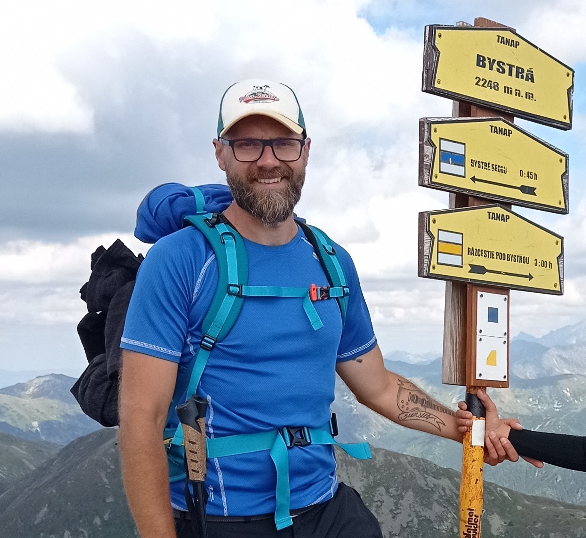

# Welcome to the portfolio page of Jaszczur1969

## About me

I am an aspiring **Data Scientist** who combines analytical thinking with **over 15 years of experience in client-facing roles**. Throughout my career, I have focused on understanding business needs and delivering solutions tailored to real challenges - an approach I now bring into the world of Data Science and AI.

I specialize in data processing, predictive modeling, and data visualization. My daily toolkit includes Python and SQL, along with libraries and tools such as Pandas, PyCaret, Scikit-Learn, OpenAI, Plotly, Seaborn, Matplotlib, MlFlow and Streamlit. I also work with databases (SQLite, Qdrant) and cloud solutions (AWS S3), as well as frameworks for model evaluation and data validation, including Evidently, Pandera, and Ydata-Profiling.

I am highly motivated to explore new technologies, learn continuously, and expand my expertise - particularly in AI and Machine Learning. With a strong work ethic, attention to detail, and customer-oriented mindset, I strive to deliver solutions that are both practical and impactful in every project I undertake.

One of my key strengths is **teamwork**, which was recognized in my previous role at Barry Callebaut Group, where I received a Teamwork Award from the management in 2021. During my time there, I led several team initiatives, including the creation and recording of a collaborative song inspired by the company’s industry (chocolate production). The result of this effort was the ["Musicolate Project"](Musicolate project/index.md) (available for review in this portfolio), which reflects both my leadership skills and creative approach to fostering team collaboration.

On a personal note, I am a happy husband, proud father of three children, and passionate about the mountains.

 

    

